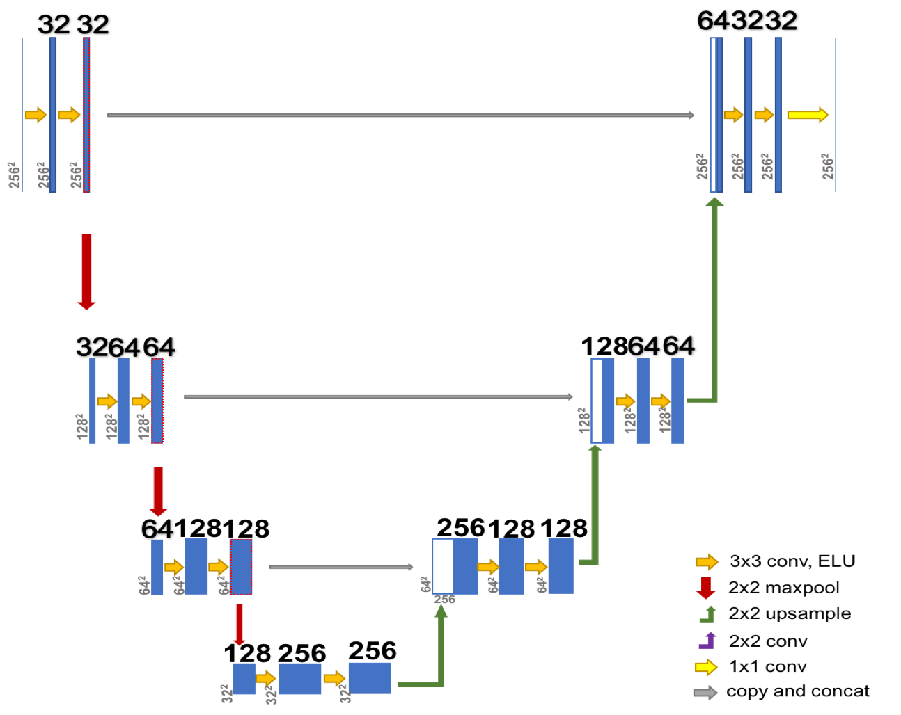
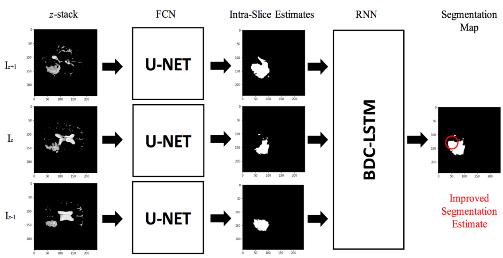
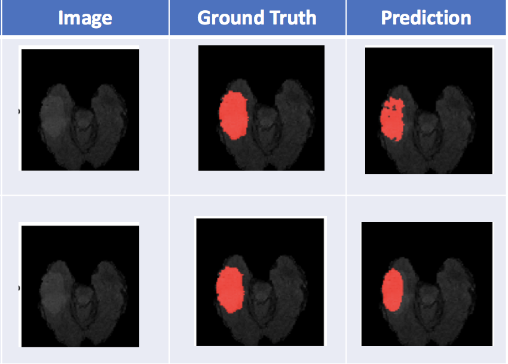
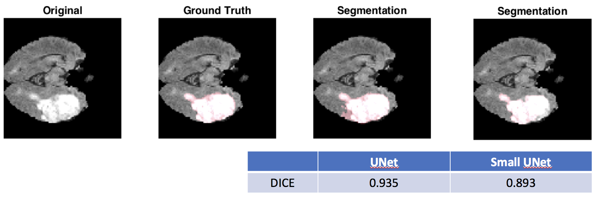

# UNet-Zoo
A collection of UNet and hybrid architectures for 2D and 3D Biomedical Image segmentation, implemented in PyTorch.

This repository contains a collection of architectures used for Biomedical Image Segmentation, implemented on the BraTS Brain Tumor Segmentation Challenge Dataset. The following architectures are implemented

1. **UNet** - Standard UNet architecture as described in the Ronneberger et al 2015 paper [[reference]](https://arxiv.org/abs/1505.04597)
1. **Small UNet** - 40x smaller version of UNet that achieves similar performance [[Theano Implementation]](https://github.com/codedecde/Luna2016-Lung-Nodule-Detection)

1. **UNet with BDCLSTM** - Combining a BDC-LSTM network with UNet to encode spatial correlation for 3D segmentation [[reference]](https://arxiv.org/pdf/1609.01006.pdf)

1. **kUNet** - Combining multiple UNets for increasing heirarchial preservation of information (coming soon) [[reference]](https://arxiv.org/pdf/1701.03056.pdf)
1. **R-UNet** - UNet with recurrent connections for another way to encode $z$-context (coming soon)
### To Run

First, apply for access the BraTS Tumor dataset, and place the scans in a `Data/` folder, divided into `Train` and `Test`. Feel free to modify the BraTS PyTorch dataloaders in `data.py` for your use.
1. UNet - run `main.py`, type `--help` for information on arguments.
1. Small UNet - run `main_small.py`, and use `--help`
1. BDC-LSTM - run `main_bdclstm.py` and use the weights for either your trained UNet or Small-UNet models (`--help` is your savior).

### Some Results

1. Comparisons of UNet (top) and Small UNet (bottom)

2. DICE Scores for UNet and Small UNet

